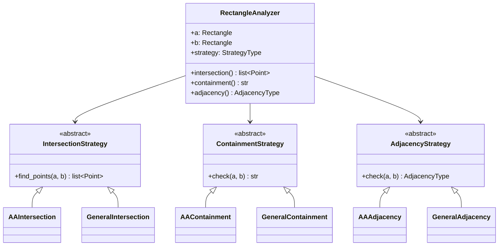
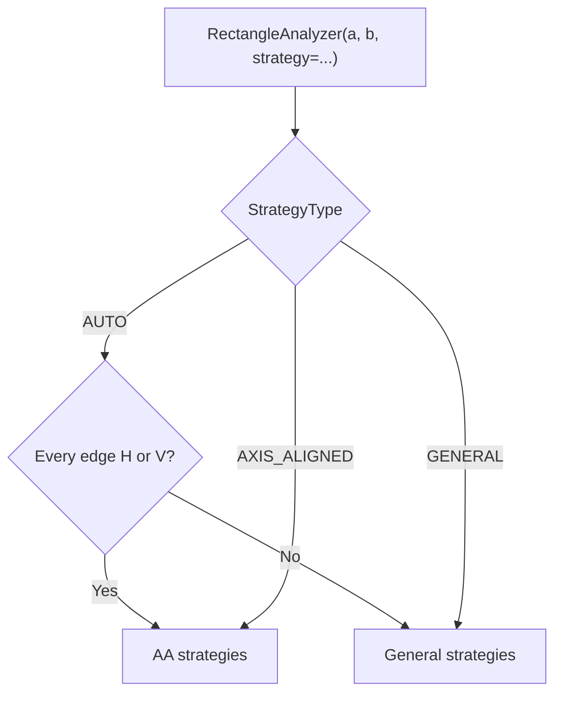

# Design Documentation

System for analyzing spatial relationships between two rectangles:
**intersection**, **containment**, and **adjacency**.

See also:
- [Problem Description](problem_description.md) — original requirements and appendix diagrams
- [Math Concepts](math_concepts.md) — parametric lines, cross products, interval overlap, etc.
- [Examples Gallery](../examples/README.md) — visual test cases with images

## Architecture



## Strategy Selection

`StrategyType` controls which algorithms are used:

| Value | Behavior |
|-------|----------|
| `AUTO` | Detects geometry — uses AA if all edges are horizontal/vertical |
| `AXIS_ALIGNED` | Forces axis-aligned strategies |
| `GENERAL` | Forces general (polygon-based) strategies |

Detection is geometric (`is_axis_aligned` property), not based on which constructor was used.



## Axis-Aligned Rectangles

Represented as `(x1, y1, x2, y2)` — bottom-left and top-right corners.
Algorithms use **1D interval comparison** for all three analyses.

## General Rectangles

Represented as 4 corner points (counter-clockwise). Algorithms use
**point-in-polygon**, **edge-edge crossing** (Cramer's rule), and
**collinear segment overlap** (dot-product projection).

Both strategies produce intersection polygon vertices (not just edge crossings),
ensuring consistent output regardless of strategy.

## Package Layout

```
src/rectangles/
├── rectangle.py          # Point, Segment, Rectangle models
├── strategies.py         # StrategyType, AdjacencyType, strategy ABCs
├── analyzer.py           # RectangleAnalyzer facade
├── axis_aligned/         # Coordinate-overlap algorithms
│   ├── intersection.py
│   ├── containment.py
│   └── adjacency.py
├── general/              # Polygon-based algorithms
│   ├── intersection.py
│   ├── containment.py
│   └── adjacency.py
├── util/                 # Shared math (cross product, Cramer, etc.)
├── visualizer.py         # Matplotlib drawing
└── cli.py                # CLI (analyze / visualize subcommands)
```

## Test Plan

Tests are organized by analysis type. Each category covers correctness,
edge cases, symmetry, and strategy parity.

For visual verification of key scenarios, see the
[Examples Gallery](../examples/README.md).

### Intersection

- **Partial overlap** — two boxes overlap producing intersection polygon vertices
- **Cross-shaped** — horizontal bar crosses vertical bar (4 vertices)
- **Containment** — inner rect fully inside outer (returns inner rect's corners)
- **Identical rectangles** — returns the shared rectangle's corners
- **Adjacent / corner-touching** — degenerate contact returns `[]`
- **Disjoint** — no contact returns `[]`
- **Commutativity** — `find(a, b) == find(b, a)` across all scenarios
- **Sorted, deduplicated output**

### Containment

- **A contains B / B contains A** — fully inside, boundary-sharing, identical
- **No containment** — disjoint, overlapping, adjacent
- **Predicate coverage** — corner on boundary, one edge exceeds, all edges exceed
- **Symmetry** — swapping a ↔ b swaps the containment label

### Adjacency

- **Proper** — entire side of A coincides with entire side of B
- **Sub-line** — one full side is contained within the other's side
- **Partial** — sides partially overlap but neither contains the other
- **None** — separated, overlapping, corner-touching, contained
- **Symmetry** — `check(a, b) == check(b, a)` for every type

### General Rectangles

- **AA parity** — same inputs produce same results as axis-aligned strategies
- **Rotated containment** — 30°/45°/60° rotated inside AA, AA inside diamond
- **Rotated overlap** — diamond overlaps box, two diamonds, different angles
- **Rotated adjacency** — shared edges after rotation, various angles
- **Rotated disjoint** — nearby but non-overlapping after rotation

### Utilities

- **`segments_intersect`** — crossing, parallel, collinear, endpoint cases
- **`collinear_segments`** — proper/sub-line/partial overlap, gap, touch-at-point
- **`point_in_polygon`** — inside, boundary (vertex/edge), outside, triangle
