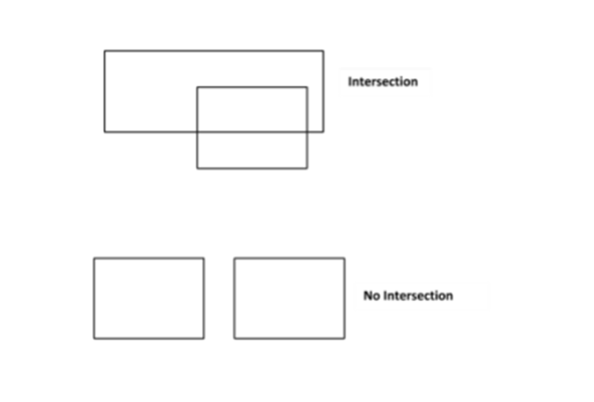
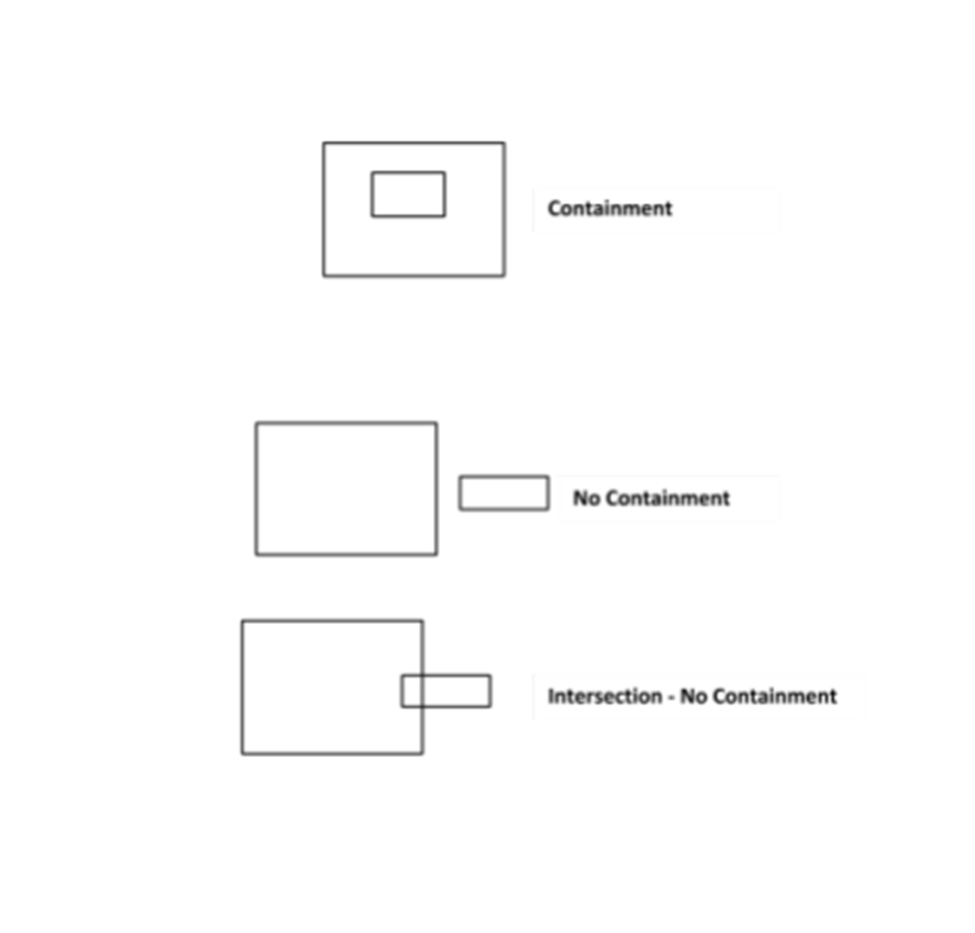
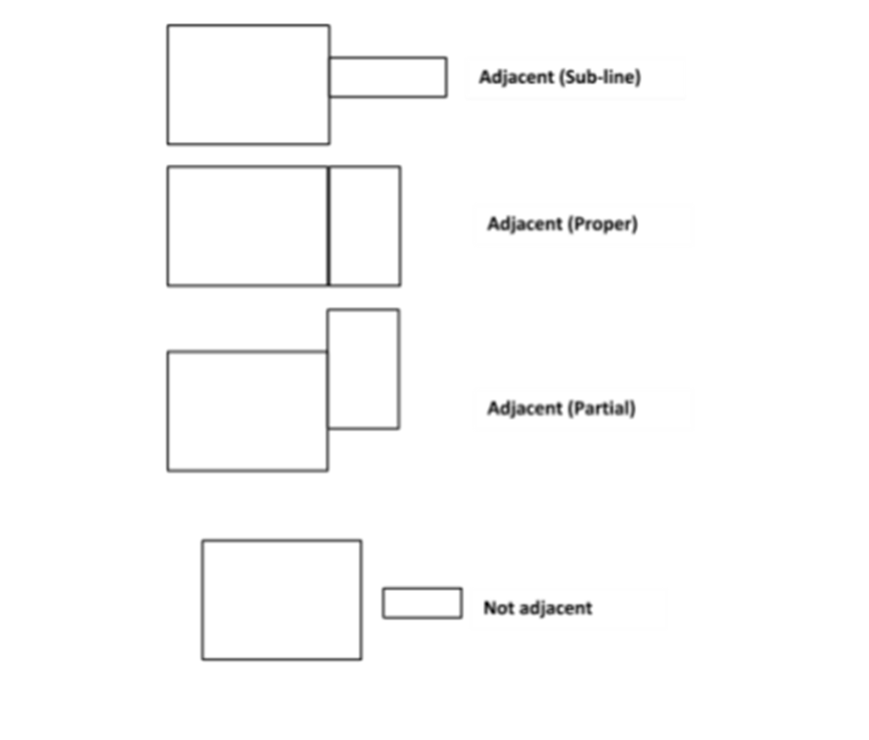

# Rectangles 

## Problem Description: 

You are required to write code implementing certain algorithms that analyze rectangles and features that exist among rectangles. Your implementation is required to cover the following: 

1. **Intersection:** You must be able to determine whether two rectangles have one or 	more intersecting lines and produce a result identifying the points of intersection. For your convenience, the scenario is diagrammed in Appendix 1. 
2. **Containment:** You must be able to determine whether a rectangle is wholly contained within another rectangle. For your convenience, the scenario is diagrammed in Appendix 2. 
3. **Adjacency:** Implement the ability to detect whether two rectangles are adjacent. Adjacency is defined as the sharing of at least one side. Side sharing may be **proper**, **sub-line** or **partial**. A **sub-line** share is a share where one side of rectangle A is a line that exists as a set of points wholly contained on some other side of rectangle B, where **partial** is one where some line segment on a side of rectangle A exists as a set of points on some side of Rectangle B. For your convenience, these scenarios are diagrammed in Appendix 3. 

## Your Submission Must Include: 
1. An implementation of the rectangle entity as well as implementations for the algorithms that define the operations listed above. 
2. Appropriate documentation 
3. Test cases/unit tests 
4. For the exercise, please add your GitHub link or another public repository when you submit your exercise. 

## NOTE: 
Feel free to expand on this problem as you wish. Document any expansion and provide it as part of your submission. 
Your submitted source code must compile (if necessary) and the resulting executable must run on Linux. Please document any library or framework dependencies. 

Appendix 1 
Intersection
 

Appendix 2 
Containment
 

Appendix 3
Adjacency

 
