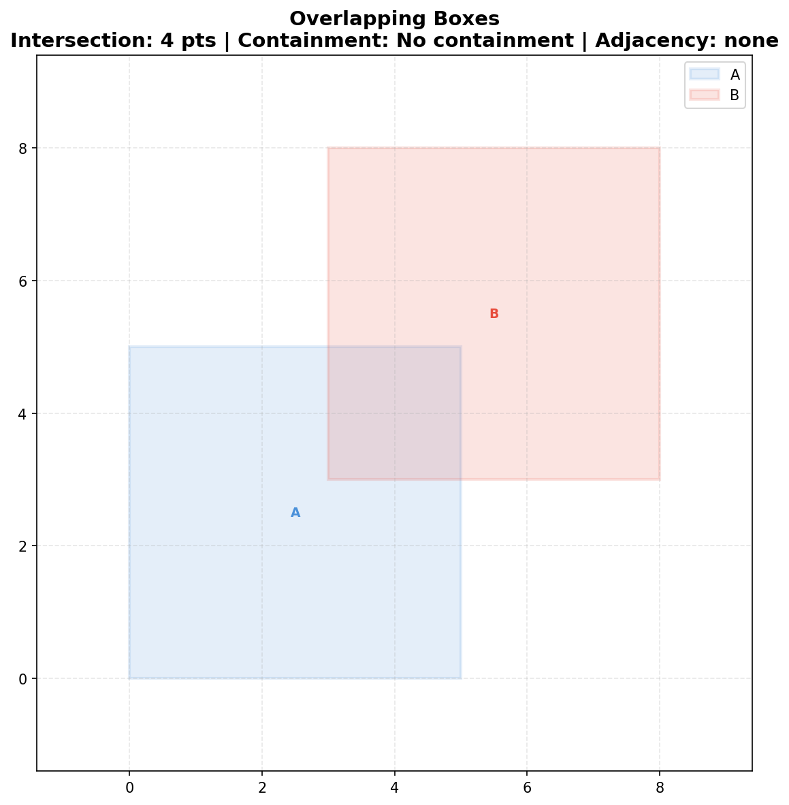
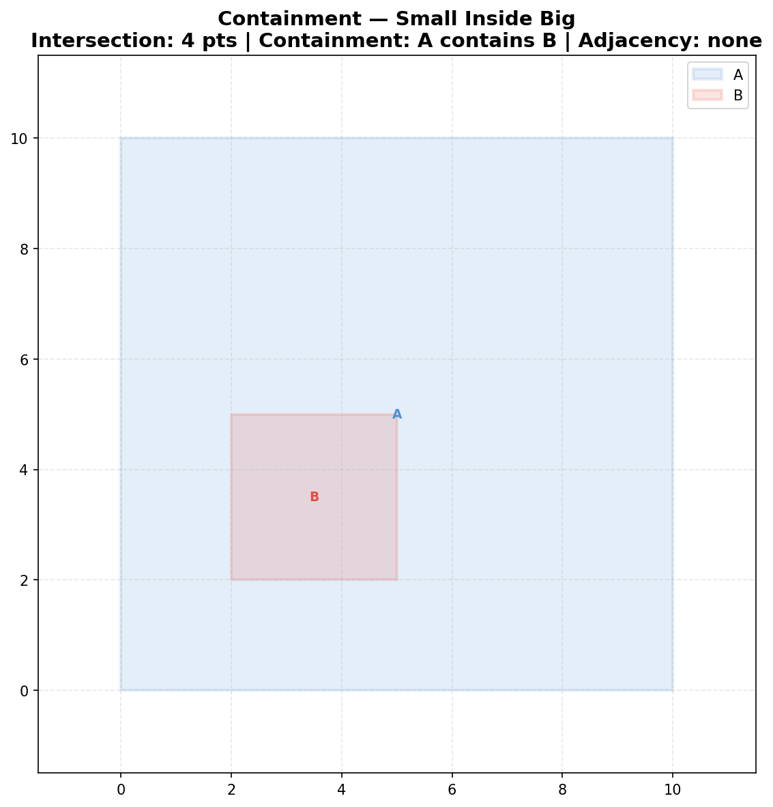
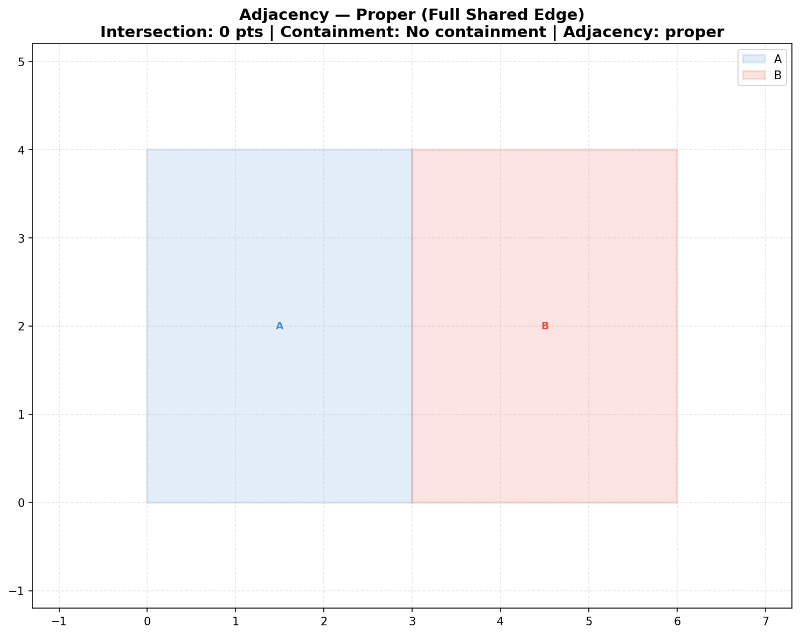
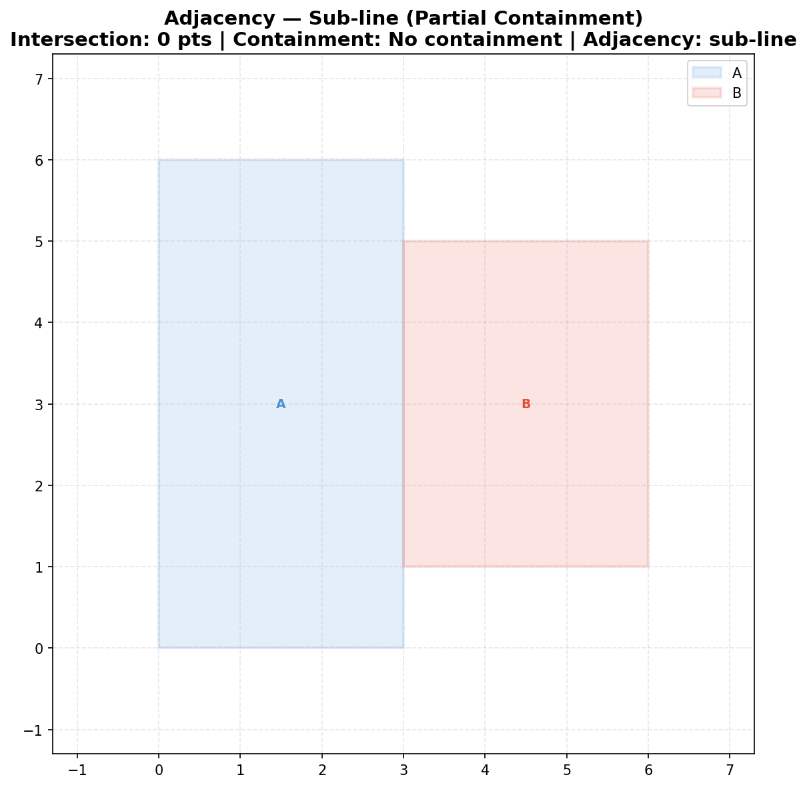
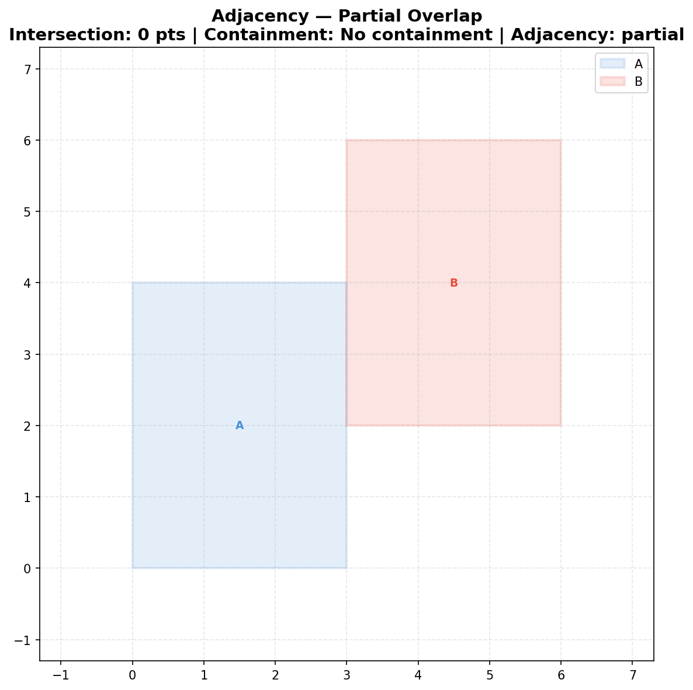
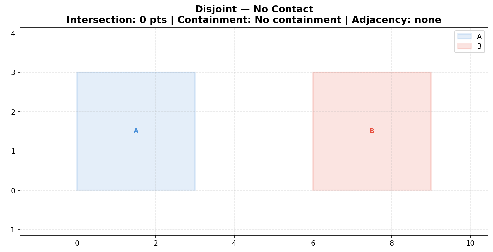
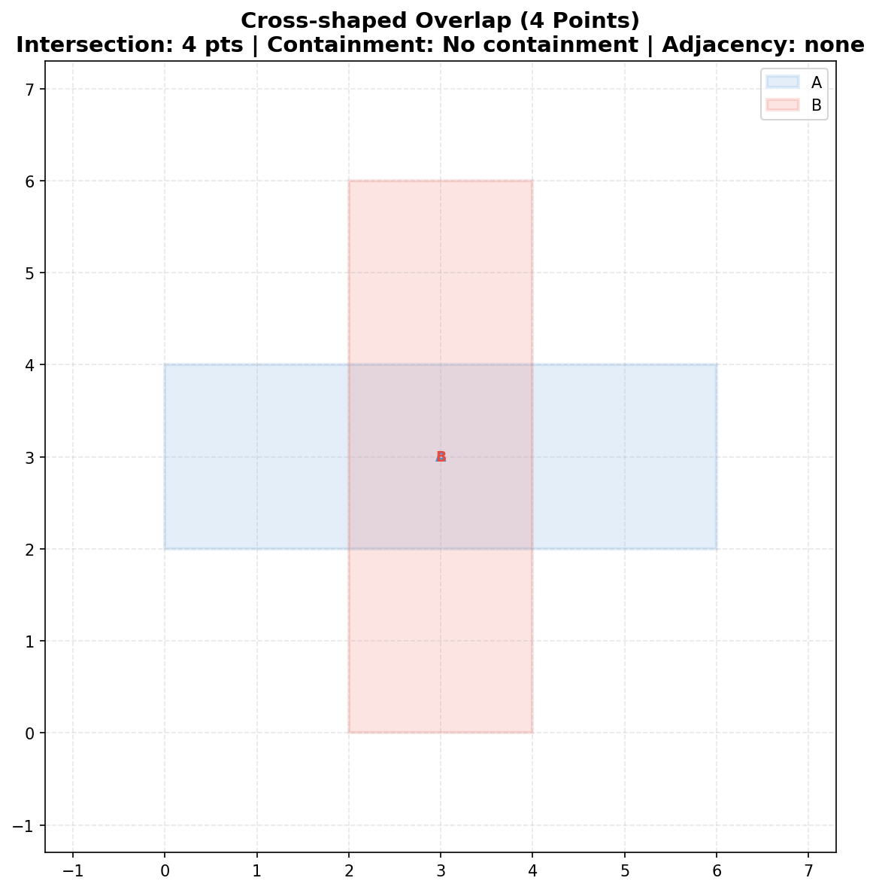
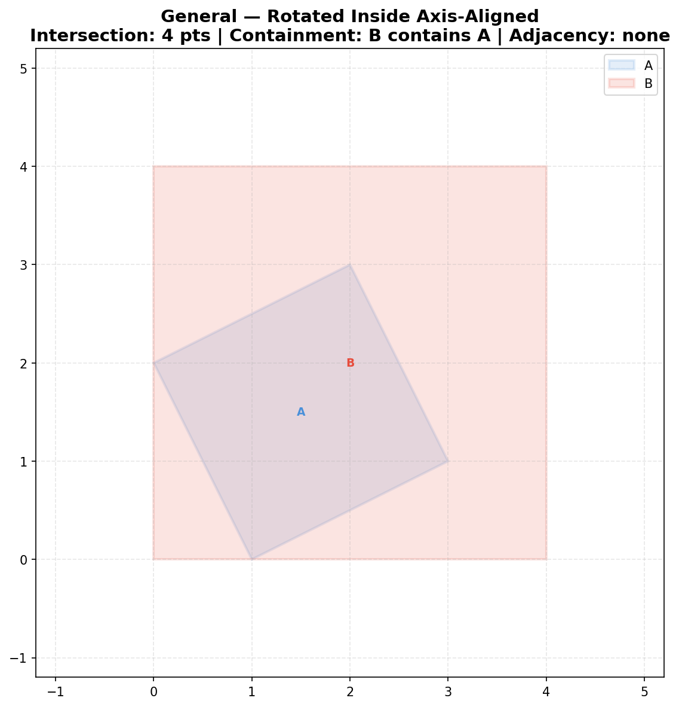
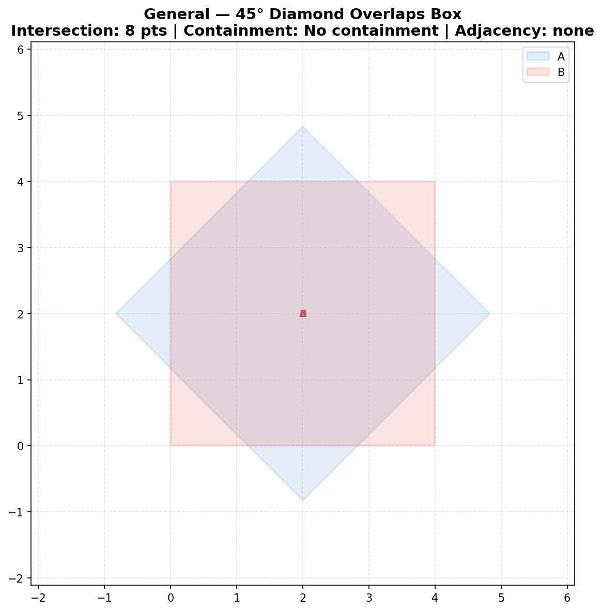

# Examples Gallery

Visual demos of rectangle analysis scenarios. Each image shows the two rectangles
with the analysis result summarized in the title.

> **Regenerate all images:** `uv run python examples/generate_images.py`

---

## 1. Intersection — Overlapping Boxes

Two boxes partially overlap, producing 4 intersection polygon vertices.

```bash
uv run rectangles analyze --a 0,0,5,5 --b 3,3,8,8
```

```
Intersection:  [(3.0, 3.0), (3.0, 5.0), (5.0, 3.0), (5.0, 5.0)]
Containment:   No containment
Adjacency:     none
```



---

## 2. Containment — Small Box Inside Big Box

Rectangle B is fully inside A. The intersection polygon is B itself.

```bash
uv run rectangles analyze --a 0,0,10,10 --b 2,2,5,5
```

```
Intersection:  [(2.0, 2.0), (2.0, 5.0), (5.0, 2.0), (5.0, 5.0)]
Containment:   A contains B
Adjacency:     none
```



---

## 3. Adjacency — Proper (Full Shared Edge)

The entire right side of A exactly matches the entire left side of B.

```bash
uv run rectangles analyze --a 0,0,3,4 --b 3,0,6,4
```

```
Intersection:  []
Containment:   No containment
Adjacency:     proper
```



---

## 4. Adjacency — Sub-line

One full side of B is contained within a side of A (neither fully coincides).

```bash
uv run rectangles analyze --a 0,0,3,6 --b 3,1,6,5
```

```
Intersection:  []
Containment:   No containment
Adjacency:     sub-line
```



---

## 5. Adjacency — Partial

The touching sides partially overlap, but neither contains the other.

```bash
uv run rectangles analyze --a 0,0,3,4 --b 3,2,6,6
```

```
Intersection:  []
Containment:   No containment
Adjacency:     partial
```



---

## 6. Disjoint — No Contact

The rectangles are completely separated with no intersection, containment, or adjacency.

```bash
uv run rectangles analyze --a 0,0,3,3 --b 6,0,9,3
```

```
Intersection:  []
Containment:   No containment
Adjacency:     none
```



---

## 7. Cross-shaped Overlap (4 Points)

A horizontal bar crosses a vertical bar, producing 4 intersection vertices.

```bash
uv run rectangles analyze --a 0,2,6,4 --b 2,0,4,6
```

```
Intersection:  [(2.0, 2.0), (2.0, 4.0), (4.0, 2.0), (4.0, 4.0)]
Containment:   No containment
Adjacency:     none
```



---

## 8. General Rectangle — Rotated Inside Axis-Aligned

A rotated rectangle (specified with 8 coordinates) inside an axis-aligned box.

```bash
uv run rectangles analyze --a 1,0,3,1,2,3,0,2 --b 0,0,4,0,4,4,0,4
```

```
Intersection:  [(0.0, 2.0), (1.0, 0.0), (2.0, 3.0), (3.0, 1.0)]
Containment:   B contains A
Adjacency:     none
```



---

## 9. General Rectangle — 45° Diamond Overlaps Box

An axis-aligned box rotated 45° to form a diamond, overlapping the original box.

```bash
uv run rectangles analyze --a 0,0,4,4 --b 0,0,4,4 --strategy general
```


